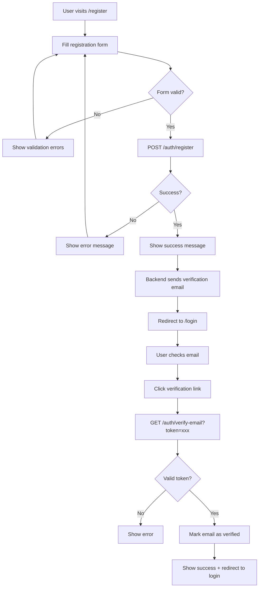
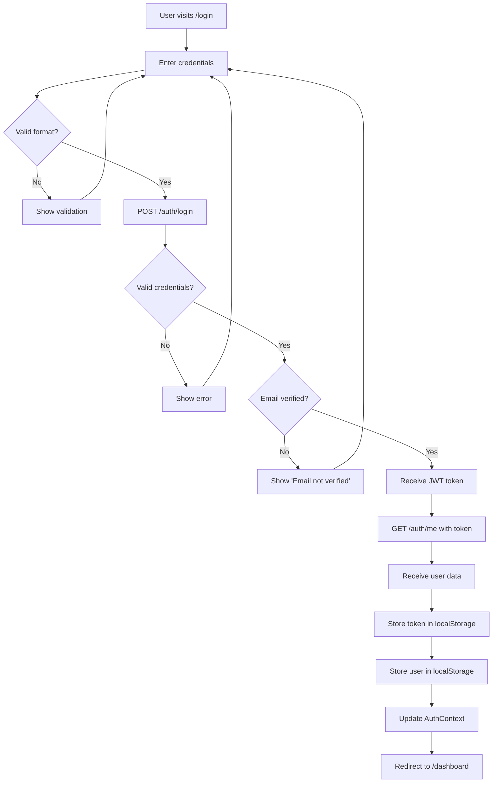
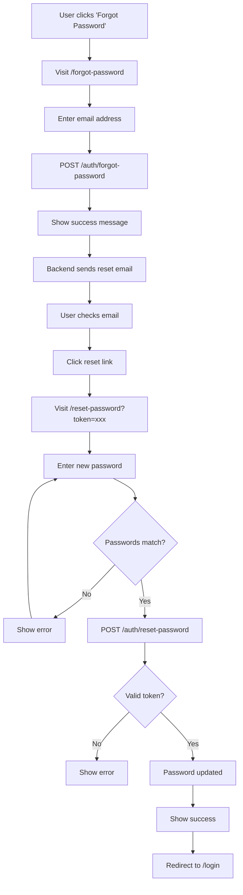
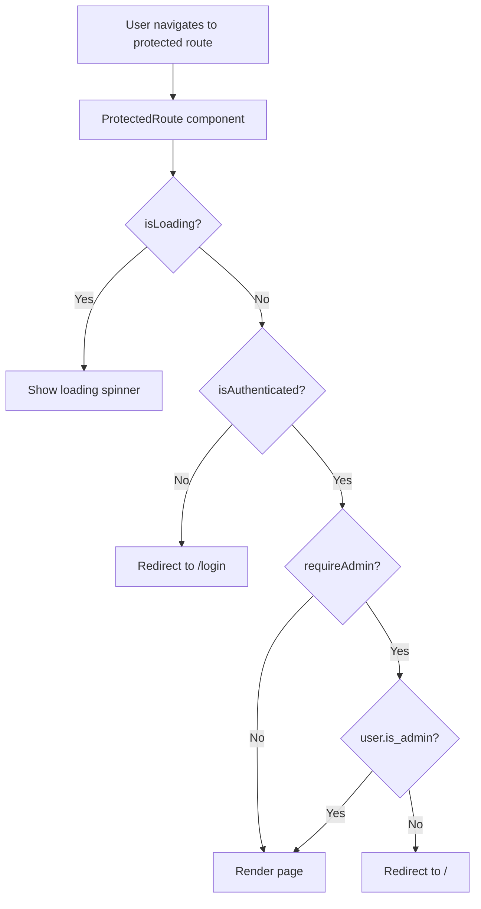
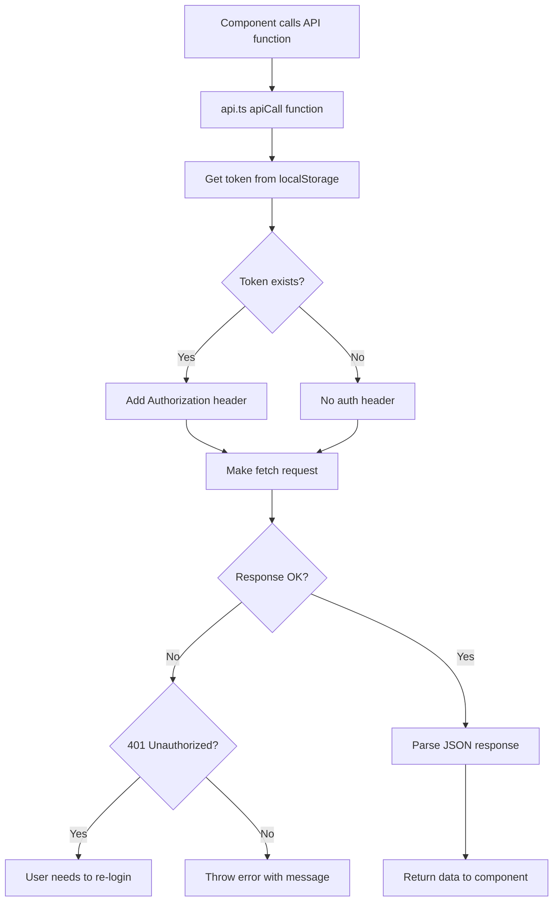
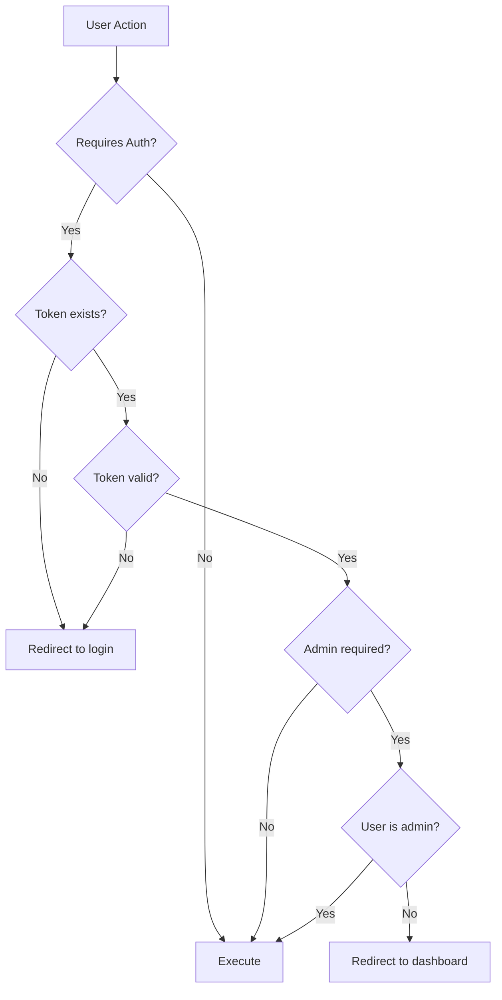
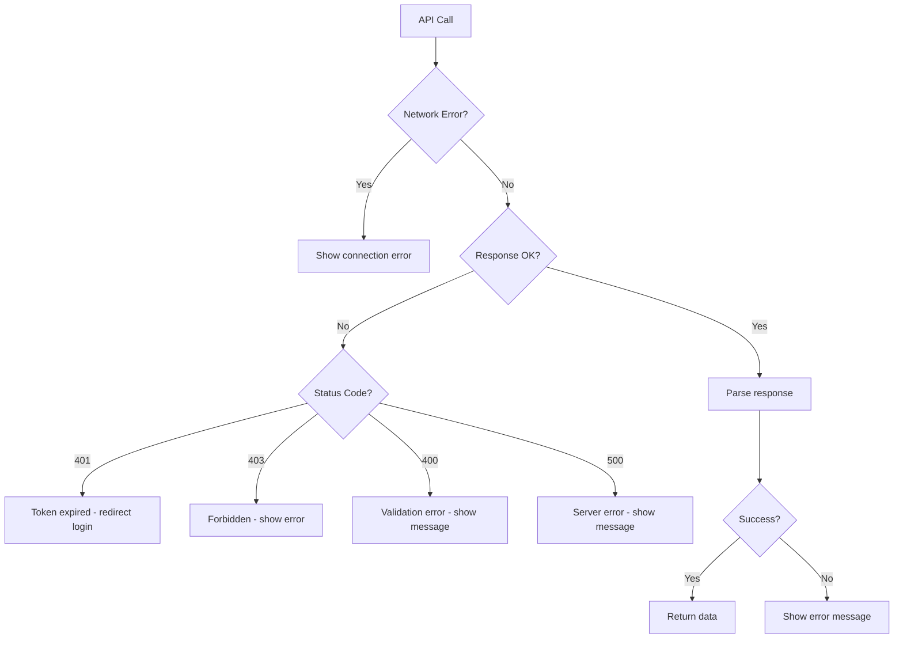

# Authentication Flow Diagrams

## 📋 Table of Contents
1. [Registration Flow](#registration-flow)
2. [Login Flow](#login-flow)
3. [Password Reset Flow](#password-reset-flow)
4. [Protected Route Flow](#protected-route-flow)
5. [API Request Flow](#api-request-flow)

---

## Registration Flow



**Key Points:**
- Email verification required before login
- Verification link expires in 24 hours
- Can resend verification if needed

---

## Login Flow



**Key Points:**
- OAuth2 password flow used
- JWT token returned
- Token stored in localStorage
- User data cached locally
- Session persists across refreshes

---

## Password Reset Flow



**Key Points:**
- Reset link expires in 1 hour
- New password must be 8+ characters
- Old password is invalidated
- User must login with new password

---

## Protected Route Flow



**Key Points:**
- All app routes wrapped in ProtectedRoute
- Auth check happens before rendering
- Admin routes require is_admin flag
- Unauthenticated users redirected to login

---

## API Request Flow



**Key Points:**
- Token automatically injected
- Works for all API endpoints
- 401 errors indicate expired token
- No manual token management needed

---

## Component Architecture

```
App.tsx (Root)
├── AuthProvider (Context)
│   ├── State: user, token, isLoading, isAuthenticated
│   └── Functions: login, register, logout
│
├── Public Routes
│   ├── /login → Login.tsx
│   ├── /register → Register.tsx
│   ├── /forgot-password → ForgotPassword.tsx
│   ├── /reset-password → ResetPassword.tsx
│   └── /verify-email → VerifyEmail.tsx
│
└── Layout (Protected)
    ├── Header
    │   ├── Logo
    │   ├── Notifications
    │   └── UserMenu
    │       ├── Avatar (user initials)
    │       ├── Full Name
    │       ├── Email
    │       └── Logout
    │
    └── ProtectedRoute Wrapper
        ├── /dashboard → Dashboard.tsx
        ├── /financial-data → FinancialData.tsx
        ├── /editorial → Editorial.tsx
        ├── /broker-reports → BrokerReports.tsx
        ├── /market-summary → MarketSummary.tsx
        ├── /filings-alerts → FilingsAlerts.tsx
        ├── /settings → Settings.tsx
        └── /admin → AdminDashboard.tsx (requireAdmin)
```

---

## State Management

```
AuthContext State
├── user: User | null
│   ├── id: string
│   ├── email: string
│   ├── full_name: string
│   ├── is_active: boolean
│   ├── is_verified: boolean
│   ├── is_admin: boolean
│   └── created_at: string
│
├── token: string | null
├── isLoading: boolean
└── isAuthenticated: boolean (computed)

LocalStorage
├── auth_token: string (JWT)
└── auth_user: string (JSON serialized User)
```

---

## Security Flow



---

## Data Flow

```
User Login
    ↓
Frontend: Login Form
    ↓
POST /auth/login (OAuth2 form)
    ↓
Backend: Validate credentials
    ↓
Backend: Check email verified
    ↓
Backend: Generate JWT token
    ↓
Frontend: Receive token
    ↓
Frontend: GET /auth/me (with token)
    ↓
Backend: Validate token
    ↓
Backend: Return user data
    ↓
Frontend: Store token + user
    ↓
Frontend: Update AuthContext
    ↓
Frontend: Redirect to dashboard
    ↓
All API calls include token
```

---

## Token Lifecycle

```
Token Creation
    ↓
Login successful
    ↓
JWT signed with SECRET_KEY
    ↓
Expires in 30 minutes
    ↓
Stored in localStorage
    ↓
Auto-injected in API calls
    ↓
Used for authentication
    ↓
Token expires (30 min)
    ↓
401 Unauthorized
    ↓
User must re-login
    ↓
New token generated
```

---

## Error Handling



---

## Forms Validation

```
Registration Form
├── Full Name
│   └── Required
├── Email
│   ├── Required
│   └── Valid email format
├── Password
│   ├── Required
│   └── Min 8 characters
└── Confirm Password
    ├── Required
    └── Must match password

Login Form
├── Email
│   ├── Required
│   └── Valid email format
└── Password
    └── Required

Change Password Form
├── Current Password
│   └── Required
├── New Password
│   ├── Required
│   └── Min 8 characters
└── Confirm Password
    ├── Required
    └── Must match new password
```

---

## Session Management

```
Session Start (Login)
    ↓
Token stored: localStorage['auth_token']
User stored: localStorage['auth_user']
    ↓
AuthContext updated
    ↓
Session Active
    ├── All API calls authenticated
    ├── Protected routes accessible
    └── User info displayed
    ↓
Session End (Logout)
    ↓
Clear localStorage['auth_token']
Clear localStorage['auth_user']
    ↓
AuthContext reset
    ↓
Redirect to /login
```

---

## Email Flows

**Registration Email:**
```
User registers
    ↓
Backend generates verification token
    ↓
Email sent with link: /verify-email?token=xxx
    ↓
User clicks link
    ↓
Token validated
    ↓
Email marked as verified
    ↓
User can login
```

**Password Reset Email:**
```
User requests reset
    ↓
Backend generates reset token
    ↓
Email sent with link: /reset-password?token=xxx
    ↓
User clicks link
    ↓
User enters new password
    ↓
Token validated
    ↓
Password updated
    ↓
User can login with new password
```

---

## Mobile/Responsive Considerations

```
All auth pages are fully responsive:
- Forms adapt to small screens
- Buttons are touch-friendly
- Text is readable on mobile
- Cards fit mobile viewports
- No horizontal scrolling
- Proper spacing for touch targets
```

---

## Performance Optimizations

```
Authentication Context
├── useEffect for initial load
├── Minimal re-renders
└── Efficient state updates

Protected Routes
├── Loading state prevents flashing
├── Auth check before render
└── Cached user data

API Calls
├── Token retrieved once per call
├── No redundant auth checks
└── Efficient error handling
```

This visual documentation helps understand the complete authentication system at a glance!
